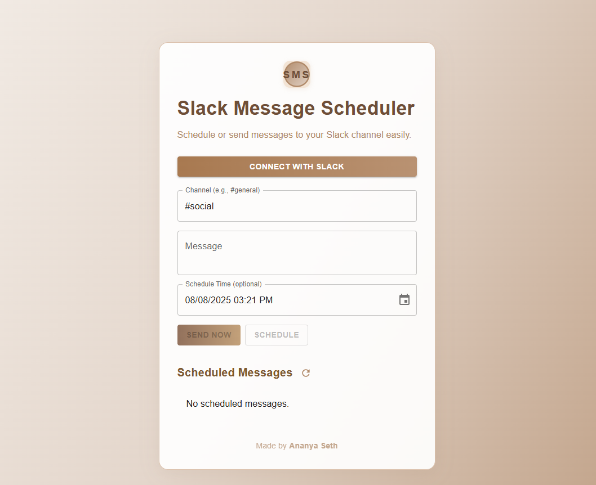

# Slack Messaage Scheduler (Slack Connect)

Welcome to my Slack Messaage Scheduler Project! This app allows you to authenticate with Slack, manage tokens securely, and automate scheduled messages. Built for learning and productivity!

---

##  Features

- Slack OAuth 2.0 Integration: Securely connect any Slack workspace.

- Access & Refresh Token Management: Secure storage and refresh logic to maintain access without repeated logins.

- Send Messages Instantly: Send messages to any Slack channel via a simple UI.

- Schedule Messages: Schedule messages for any future date and time.

- Manage Scheduled Messages: View, list, and cancel scheduled messages before they are sent.

---

## Technology Stack

- Frontend : TypeScript/React.js
- Backend : Node.js (with Express.js, TypeScript)
 

---

##  Screenshots 

- 
  
---
 ## Demo Video 
 - [demo video](https://1drv.ms/v/c/03da0dc246a39a47/EZHyB2AfSj1Hh3YJZvvrQdABpfZX3a729wIGTzkqJsj-8Q)

---

## Setup Instructions

## 1. Clone the Repository

- git clone https://github.com/29ananyaseth/slack-connect-app.git

- cd slack-connect-app

## 2. Backend Setup

- cd backend
  npm install

- Create a .env file with your configuration:

1-SLACK_CLIENT_ID=your-slack-client-id

2-SLACK_CLIENT_SECRET=your-slack-client-secret

3-SLACK_REDIRECT_URI=http://localhost:5000/api/slack/oauth/callback

4-JWT_SECRET=your-jwt-secret

- Run the backend:

npm run dev

## 3. Frontend Setup

cd ../frontend
npm install

- Create a .env file in /frontend:

REACT_APP_API_URL=http://localhost:5000

- Run the frontend:

npm start

---

## Architectural Overview

- OAuth 2.0 Flow:

- User authorizes the app via Slack.

- Backend receives authorization code, exchanges it for access & refresh tokens, and stores them securely.

- Implements refresh token logic to maintain seamless access.

---

## Message Scheduling:

- Users compose a message, select a channel, and choose to send now or later.

- Scheduled messages are stored in the database and reliably dispatched at the specified time (using a background scheduler).

- Scheduled Message Management:

The UI displays all scheduled messages with options to cancel any before their scheduled time.

- Token Security:

All tokens are securely stored in the backend and never exposed to the frontend.

##  Deployment
- Frontend: Render 

- Backend: Render 

---

## Challenges & Learnings

- OAuth Complexity:
Integrating Slack's OAuth 2.0 flow and securely managing tokens required careful implementation.

- Token Refresh:
Ensuring the app can automatically refresh Slack tokens so users never lose access was a key technical challenge.

- Accurate Scheduling:
Scheduling messages to be sent exactly at the specified time and managing them reliably, even after server restarts, required a robust background job system.

- User Experience:
Designing a user-friendly interface for scheduling and managing messages took several iterations.

